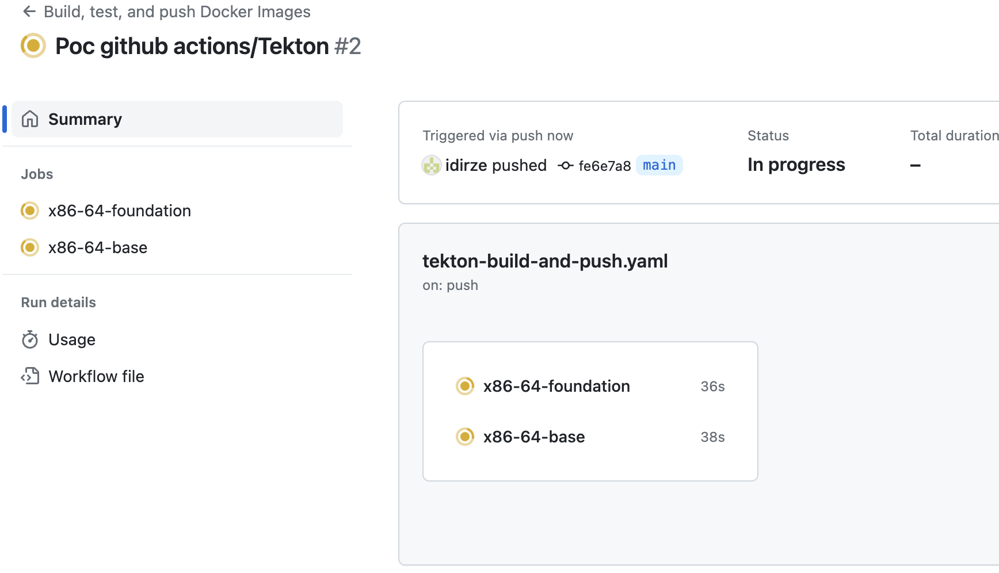
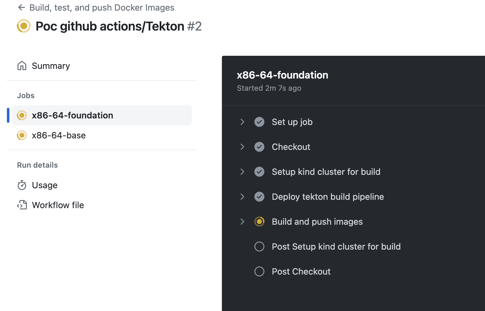

# tekton-github-actions

:bulb: **Notes**

- Argo workflows but with catalog of prebuilt tasks: https://github.com/tektoncd/catalog/tree/main/task
- Kind takes up +60 seconds to start
- Tekton is rather a framework and requires dev to handle tasks status (exit codes) and correct logging
- Shell scripts based development 
- Local debug with Act
- **3 deployment schemes**
    * 1- Individual tasks execution scheduled by github actions**
      * The execution unit is a Task (tekton task with one step executed by one single github action): possibilty to parallelize in multiple github actions VMs by running multiple github actions jobs
      * Ability to keep github actions execution flow (UI) at step level => Tekton Task = Tekton Step
      * Exexution flow in Tekton dashboard can be misleading
      * No task reuse possibility in the steps
      * Refactoring (taskName may be hard, ...)
      * Requires to maintain 2 pipelines: github actions pipeline + tekton Pipeline
    * 2- Tekton pipeline
      * Execution unit is pipeline. The entire pipeline run on a single github actions VM
      * No execution flow inside github actions at step level. The whole pipeline run as a single step (hard to troubleshoot)
      * Troubleshooting complex pipeline is hard without Tekton UI
      * Task reuse
    * 3- Consider specific projects images build as specific topic and run okdp images with github actions (releases only + act for testing)
      * With Github actions
        * Everything is on github including workflow build pipelines
        * Enhance contributions ...
        * Seamless integration with github features (pull requests/merge, manage issues, ...)
        * Active large community (community built actions, documentation, support, ...)
        * Easy to manage, ...
    

:information_source: **Execution**

Example:

There is one Kind cluster per Github actions job:


```shell
$ kind get clusters
  build-cluster-x86-64-base
  build-cluster-x86-64-foundation
```

:information_source: **Two jobs run in parallel**



:information_source: **The steps**


